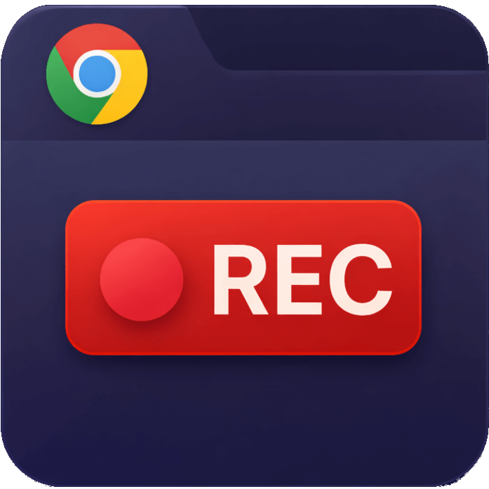

# Tab Recorder

<p align="center">
  
</p>

Extensão Chrome (Manifest V3) que grava **vídeo + áudio** da aba atual — ou **somente o áudio** — e oferece uma barra de comandos com Gravar, Pausar, Stop e opção de onde salvar o arquivo (`.webm`).

**Autor:** Morris Ruschel (Mad Wolf)  
**Licença:** MIT — veja [LICENSE](LICENSE). Código aberto, use e modifique como quiser.

**Repositório:** [GitHub — google-chrome-extension-tab-recorder](https://github.com/MorrisRuschel/google-chrome-extension-tab-recorder)

---

## Funcionalidades

- Gravar **vídeo + áudio** ou **somente áudio** da aba atual (via `chrome.tabCapture`; modo escolhido no popup)
- **Barra de comandos:** Gravar, Pausar/Retomar, Stop, Mute/Unmute do áudio gravado
- **Timer** de gravação (atualizado em tempo real)
- Escolha de **pasta e nome do arquivo** (relativo à pasta de Downloads); o nome é respeitado na janela “Salvar como”
- **Ouvir o áudio** da aba enquanto grava
- Ao parar: diálogo **“Salvar como”** para escolher onde salvar o `.webm`
- **Página de gravação** (aba da extensão): aviso para não fechar, controles (Pausar, Stop, Áudio), histórico das últimas gravações e botão para limpar o histórico
- **Reutilização da aba:** ao clicar em Gravar, a extensão reutiliza a aba da página de gravação se ela já estiver aberta (só abre uma nova se estiver fechada)
- No **popup:** link “Página de gravação” para abrir a aba da extensão ou ir para ela se já existir

---

## Instalação (desenvolvimento)

1. Abra `chrome://extensions`
2. Ative **Modo do desenvolvedor**
3. Clique em **Carregar sem compactação** e selecione a pasta `extension/`
4. (Opcional) Fixe a extensão na barra e use o ícone para abrir o popup

---

## Estrutura

```
extension/
├── logo.png         (ícone empacotado na extensão)
├── manifest.json
├── popup.html
├── popup.js
├── background.js
├── recorder.html
└── recorder.js
id/
└── icone.png        (identidade visual / README)
social/
├── post1.png
└── post2.png        (artes de divulgação; ver social/.gitignore)
```

Na raiz: `README.md`, `LICENSE`.

---

## Publicar na Chrome Web Store

Para publicar a extensão na [Chrome Web Store](https://chrome.google.com/webstore):

### 1. Conta de desenvolvedor

- Acesse o [Chrome Developer Dashboard](https://chrome.google.com/webstore/devconsole).
- Entre com sua conta Google.
- Aceite os termos e pague a **taxa única de registro** (cerca de **US$ 5**). Com isso você pode publicar até 20 extensões com a mesma conta.
- Documentação: [Registrar conta](https://developer.chrome.com/docs/webstore/register) e [Configurar conta](https://developer.chrome.com/docs/webstore/set-up-account).

### 2. Preparar o pacote (ZIP)

- O ZIP deve ter o **manifest.json na raiz** (não dentro de uma pasta).
- Na pasta do projeto, empacote só o conteúdo da pasta `extension/`:

  ```bash
  cd extension
  zip -r ../tab-recorder.zip . -x "*.DS_Store"
  ```

  Ou use o explorador de arquivos: selecione todos os arquivos **dentro** de `extension/` (manifest.json, popup.html, popup.js, background.js, recorder.html, recorder.js, logo.png) e compacte em um ZIP.

- Verifique o [manifest](https://developer.chrome.com/docs/webstore/prepare#review-your-manifest): `name`, `version`, `description` e `icons` preenchidos. O primeiro número de versão pode ser baixo (ex.: 1.0.0) para poder subir depois em atualizações.

### 3. Enviar no Dashboard

- No [Dashboard](https://chrome.google.com/webstore/devconsole), clique em **“Novo item”** (Add new item).
- Envie o arquivo ZIP da extensão.
- Se o manifest e o ZIP estiverem válidos, o item será criado e você poderá editar as abas no painel.

### 4. Preencher a ficha da loja

- **Store Listing:** descrição, capturas de tela, ícone pequeno (128×128), categoria, idioma, etc. [Criar uma boa página](https://developer.chrome.com/docs/webstore/best_listing).
- **Privacy:** declarar uso de dados e finalidade única; se não usar dados sensíveis, indicar isso.
- **Distribution:** países onde a extensão ficará disponível e se é gratuita ou paga.

### 5. Enviar para revisão

- Depois de preencher as abas, clique em **“Enviar para revisão”** (Submit for Review).
- A Google pode levar alguns dias para analisar. A extensão pode ser publicada automaticamente após aprovação ou você pode escolher publicar manualmente depois.

Referências oficiais: [Publicar na Chrome Web Store](https://developer.chrome.com/docs/webstore/publish), [Preparar a extensão](https://developer.chrome.com/docs/webstore/prepare), [Processo de revisão](https://developer.chrome.com/docs/webstore/review-process).

---

## Limitações

- Páginas com DRM podem bloquear a captura
- O local de salvamento é relativo à pasta de Downloads do Chrome
- Gravações muito longas podem exigir mais memória

---

© Morris Ruschel (Mad Wolf) — projeto aberto no GitHub.
