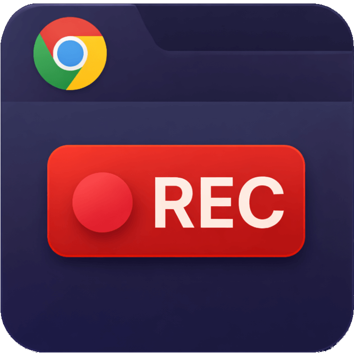

# Tab Recorder

<p align="center">
  
</p>

Extensão Chrome (Manifest V3) que grava **vídeo + áudio** da aba atual — ou **somente o áudio** — e oferece uma barra de comandos com Gravar, Pausar, Stop e opção de onde salvar o arquivo (`.webm`).

**Autor:** Morris Ruschel (Mad Wolf)  
**Licença:** MIT — veja [LICENSE](LICENSE). Código aberto, use e modifique como quiser.

**Repositório:** [GitHub — google-chrome-extension-tab-recorder](https://github.com/MorrisRuschel/google-chrome-extension-tab-recorder)

---

## Funcionalidades

- Gravar **vídeo + áudio** ou **somente áudio** da aba atual (via `chrome.tabCapture`; modo escolhido no popup)
- **Barra de comandos:** Gravar, Pausar/Retomar, Parar, Mute/Unmute do áudio gravado (o áudio continua audível na aba)
- **Timer** de gravação (atualizado em tempo real)
- Escolha de **pasta e nome do arquivo** (relativo à pasta de Downloads); o nome é respeitado na janela “Salvar como”
- **Ouvir o áudio** da aba enquanto grava
- Ao parar: diálogo **“Salvar como”** para escolher onde salvar o `.webm`; se o download falhar ou for cancelado, a gravação fica na página de gravação com as opções **Salvar novamente** / **Descartar**
- Se a aba gravada for fechada, a gravação é finalizada e salva automaticamente
- **Página de gravação** (aba da extensão): aviso para não fechar, controles (Pausar, Parar, Áudio), histórico das últimas gravações e botão para limpar o histórico
- **Idiomas:** português (Brasil) e inglês, conforme o idioma do navegador (`_locales/`)
- **Reutilização da aba:** ao clicar em Gravar, a extensão reutiliza a aba da página de gravação se ela já estiver aberta (só abre uma nova se estiver fechada)
- No **popup:** link “Página de gravação” para abrir a aba da extensão ou ir para ela se já existir

---

## Instalação (desenvolvimento)

1. Abra `chrome://extensions`
2. Ative **Modo do desenvolvedor**
3. Clique em **Carregar sem compactação** e selecione a pasta `extension/`
4. (Opcional) Fixe a extensão na barra e use o ícone para abrir o popup

---

## Estrutura

```
extension/
├── _locales/
│   ├── en/messages.json      (inglês — padrão)
│   └── pt_BR/messages.json   (português do Brasil)
├── logo.png         (ícone empacotado na extensão)
├── manifest.json
├── background.js    (service worker: estado da gravação e coordenação)
├── common.css       (estilos compartilhados)
├── common.js        (i18n e barra de controles compartilhados)
├── popup.html
├── popup.js
├── recorder.html
└── recorder.js      (captura, MediaRecorder e download)
id/
└── icone.png        (identidade visual / README)
```

Na raiz: `README.md`, `LICENSE`.

---

## Limitações

- Páginas com DRM podem bloquear a captura
- O local de salvamento é relativo à pasta de Downloads do Chrome
- Gravações muito longas podem exigir mais memória

---

© Morris Ruschel (Mad Wolf) — projeto aberto no GitHub.
